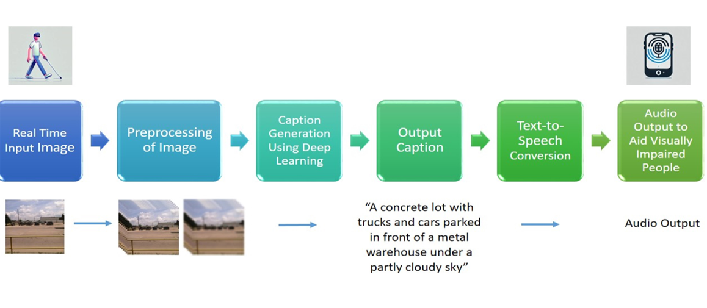

# Real-Time-Image-Captioning-to-Assist-the-Visually-Impaired

This project focuses on real-time image caption generation to assist visually impaired individuals. The system captures images using a smartphone, processes them through a deep learning-based captioning model, and provides audio feedback describing the scene.

**Features**
1. Real-time image capture via a mobile app

2. Image caption generation using a fine-tuned CLIP-GPT2 model

3. Converts captions to speech using Google Text-to-Speech (gTTS)

**Techstack**
1. Frontend: React Native (react-native-vision-camera for image capture)

2. Backend: Flask (Python)

3. Model: Fine-tuned CLIP-GPT2 (hosted on Hugging Face)

4. Audio: gTTS for text-to-speech conversion

**Dataset**

Fine-tuned on the VizWiz dataset to better handle real-world images captured by visually impaired users.

**System Architecture**

The following diagram explains the system flow from image capture to audio feedback.

**Results**
1. Successfully generates relevant captions in real-time.

2. Provides immediate audio feedback.

**Acknowledgements**
1. CLIP-GPT2

2. VizWiz Dataset

3. gTTS: Google Text-to-Speech
