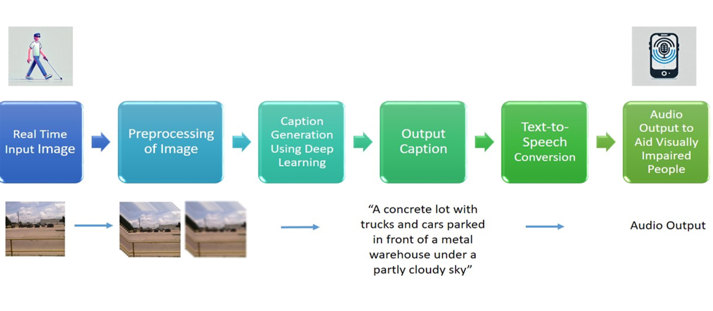
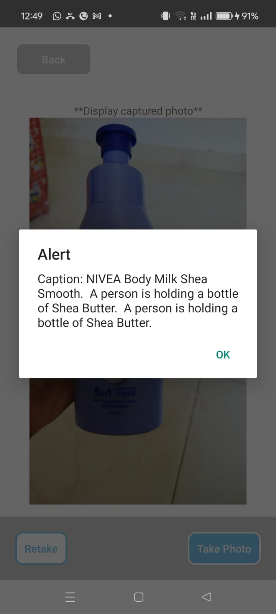
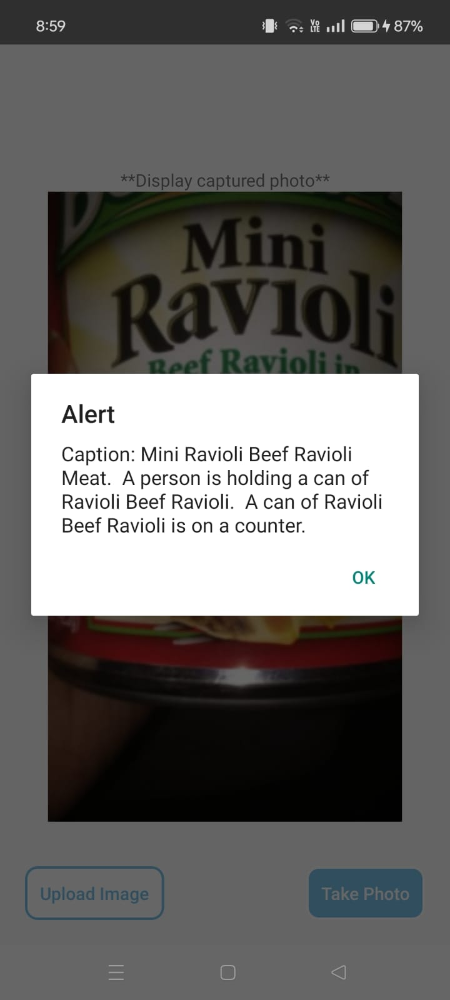
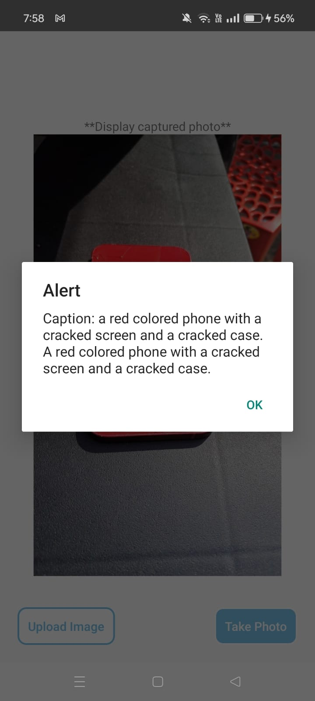
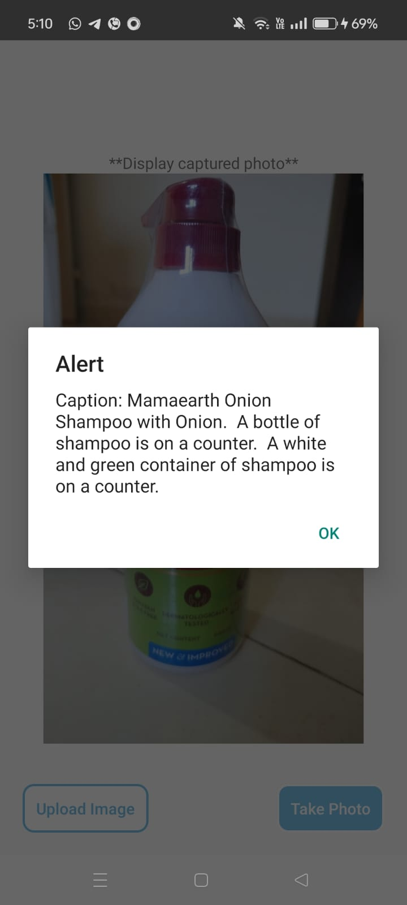
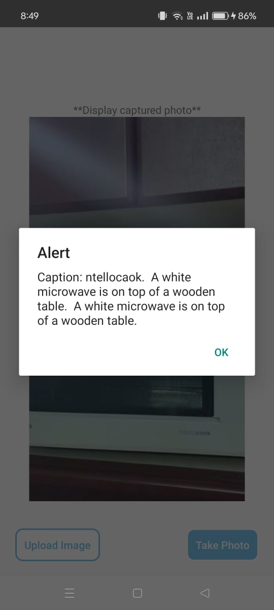

# Real-Time-Image-Captioning-to-Assist-the-Visually-Impaired

This project implements a real-time image captioning system designed to help visually impaired individuals better understand their surroundings. The system captures images via a smartphone app, processes them through a fine-tuned CLIP–GPT2 captioning model, and delivers immediate audio descriptions of the scene.

## Features
1. Real-time image capture via a mobile app

2. Image caption generation using a fine-tuned CLIP-GPT2 model hosted on HuggingFace

3. Audio feedback using Google Text-to-Speech (gTTS)
   
4. Optimized for real-world images

## Techstack
1. Frontend: React Native (react-native-vision-camera for image capture)

2. Backend: Flask (Python)

3. Model: Fine-tuned CLIP-GPT2 (hosted on Hugging Face)
   
4. OCR: EasyOCR for handling text within images

5. Audio: gTTS for text-to-speech conversion

## Dataset

[VizWiz](https://vizwiz.org/tasks-and-datasets/image-captioning/): images taken by blind photographers with five human-written captions each. Training used 40,000 caption–image pairs. The dataset's real-world noise (blur, dark frames, extreme angles) makes it more representative of actual use than standard captioning benchmarks.

## System Architecture

The following diagram explains the system flow from image capture to audio feedback.

1. User captures image in the app

2. Image sent to Flask backend

3. Caption generated by fine-tuned CLIP–GPT2 (+ OCR for text regions)

4. Caption converted to audio with gTTS

5. Audio played back on the smartphone

## Quantitative Evaluation

Evaluated on 300 randomly sampled VizWiz validation images (seed 0) using standard image captioning metrics.

| Metric | Score |
|--------|-------|
| BLEU-1 | 0.5068 |
| BLEU-2 | 0.3627 |
| BLEU-3 | 0.2761 |
| BLEU-4 | 0.2273 |
| ROUGE-L | 0.3558 |
| **CIDEr** | **0.9615** |
| OCR recall | 0.912 |

Evaluation script: `scripts/evaluate.py`

CIDEr (0.9615) is the most caption-specific metric, measuring n-gram similarity weighted 
by informativeness against the five human-written VizWiz reference captions per image, 
a score of 0.96 indicates strong alignment with human descriptions. 
OCR recall of 0.912 
means detected text appears in the generated caption in over 91% of cases.

## Qualitative Results

The system successfully generates relevant captions in real-time and provides immediate audio feedback (latency < 5s) to the user.  
Below are some example outputs:

> **Generated Caption:**  
> "NIVEA Body Milk Shea Smooth. A person is holding a bottle of Shea Butter. A person is holding a bottle of Shea Butter."

> **Generated Caption:**  
> "Lets stay fkt Lipton Green. A person is holding a green tea packet. A person is holding a green tea packet."

> **Generated Caption:**
> "Mini Ravioli Beef Ravioli Meat. A person is holding a can of Ravioli Beef. A can of Ravioli Beef is on a counter."

> **Generated Caption:**
> “A red coloured phone with a cracked screen and a cracked case. A red coloured phone with a cracked screen and a cracked case.”

> **Generated Caption:**
> “Mamaearth Onion shampoo with Onion. A bottle of shampoo is on a counter. A bottle of shampoo is on a counter.”

> **Generated Caption:**
> "A white egg laying on a wooden surface. A white egg laying on a wooden surface."

> **Generated Caption:**
> "ntellocook. A white microwave is on top of a wooden table. A white microwave is on top of a wooden table."

## Experimental OCR-Augmented Training

Beyond the deployed system, we explored conditioning the captioning model on OCR tokens during training. The motivation was to reduce the train–test mismatch introduced by the original pipeline, where OCR was only used at inference time.

### Hypothesis

If OCR text were provided during training alongside image features, the model could learn stronger associations between textual cues in the image and the generated caption. So:

[CLIP Prefix (10)] + [OCR Tokens (≤10)] + [Caption Tokens (≤50)]

### Outcome

The OCR-conditioned model produced lower-quality captions than the baseline model. Common failure modes included:

- Repetition during generation
- Copying noisy OCR strings into the caption
- Reduced caption fluency
- Occasional improvements when OCR contained highly informative text

### Possible Causes

- Noisy OCR extracted from low-quality VizWiz images
- Attention allocated to irrelevant OCR tokens
- Increased prefix length compared to the original ClipCap design
- Limited availability of clean OCR-caption supervision

### Key Observation

Although OCR-conditioned training underperformed, lightweight OCR augmentation at inference time remained useful and often improved recognition of text-heavy objects such as product packaging, appliance displays, and thermostats. This suggests that OCR was more effective as a controlled inference-time signal than as an additional train-time conditioning input under the available caption supervision.

## Acknowledgements

This project was made possible thanks to the following resources and tools:  

- [ClipCap](https://github.com/rmokady/CLIP_prefix_caption) for vision-language caption generation  
- [VizWiz Dataset](https://vizwiz.org/tasks-and-datasets/image-captioning/) for fine-tuning  
- [gTTS (Google Text-to-Speech)](https://pypi.org/project/gTTS/) for converting captions to audio feedback
- [EasyOCR](https://github.com/JaidedAI/EasyOCR)
