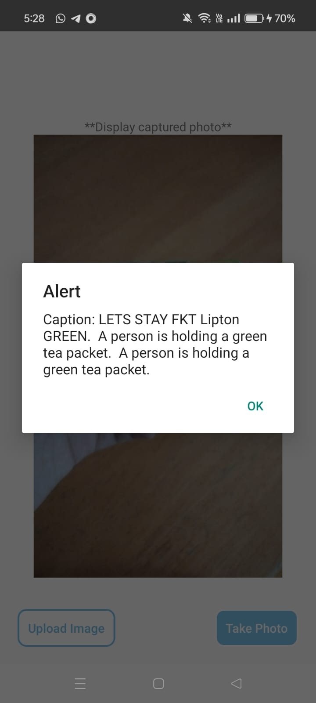

# Real-Time-Image-Captioning-to-Assist-the-Visually-Impaired

This project implements a real-time image captioning system designed to help visually impaired individuals better understand their surroundings. The system captures images via a smartphone app, processes them through a fine-tuned CLIP–GPT2 captioning model, and delivers immediate audio descriptions of the scene.

**Features**
1. Real-time image capture via a mobile app

2. Image caption generation using a fine-tuned CLIP-GPT2 model hosted on HuggingFace

3. Audio feedback using Google Text-to-Speech (gTTS)
   
4. Optimized for real-world images

**Techstack**
1. Frontend: React Native (react-native-vision-camera for image capture)

2. Backend: Flask (Python)

3. Model: Fine-tuned CLIP-GPT2 (hosted on Hugging Face)
   
4. OCR: EasyOCR for handling text within images

5. Audio: gTTS for text-to-speech conversion

**Dataset**

VizWiz: A dataset of images taken by visually impaired users, used for fine-tuning the captioning model.
Focused on robustness to low-light, blurred, and text-containing images.

**System Architecture**

The following diagram explains the system flow from image capture to audio feedback.

1. User captures image in the app

2. Image sent to Flask backend

3. Caption generated by fine-tuned CLIP–GPT2 (+ OCR for text regions)

4. Caption converted to audio with gTTS

5. Audio played back on the smartphone

**Results**

The system successfully generates relevant captions in real-time and provides immediate audio feedback (latency ~ 20s) to the user.  
Below are some example outputs:

Generated Caption: "NIVEA Body Milk Shea Smooth. A person is holding a bottle of Shea Butter. A person is holding a bottle of Shea Butter."

Generated Caption: “Lets stay fkt Lipton Green. A person is holding a green tea packet. A person is holding a green tea packet.”

**Acknowledgements**
1. CLIP-GPT2

2. VizWiz Dataset

3. gTTS: Google Text-to-Speech
